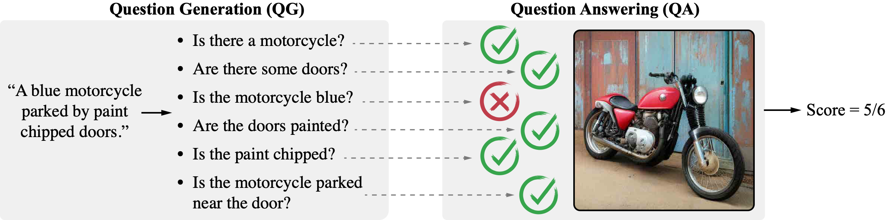
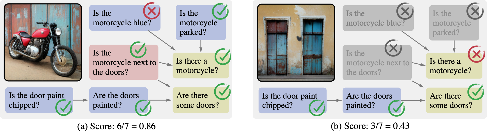

# Davidsonian Scene Graph (DSG) Code

> [!NOTE]
> For more info about DSG, please visit our [project page](https://google.github.io/dsg/).

This repository contains the code for **DSG**, a new framework for fine-grained text-to-image evaluation using Davidsonian semantics, as described in the paper:

**[Davidsonian Scene Graph: Improving Reliability in Fine-grained Evaluation for Text-to-Image Generation (ICLR 2024)](https://arxiv.org/abs/2310.18235)**

by  [Jaemin Cho](https://j-min.io),
[Yushi Hu](https://yushi-hu.github.io/),
[Jason Baldridge](http://jasonbaldridge.com/),
[Roopal Garg](https://roopalgarg.com/),
[Peter Anderson](https://panderson.me/),
[Ranjay Krishna](https://ranjaykrishna.com/),
[Mohit Bansal](https://www.cs.unc.edu/~mbansal/),
[Jordi Pont-Tuset](https://jponttuset.cat/),
[Su Wang](https://research.google/people/107321/)


## Updates

- Mar 18, 2024: We have released -
  - (1) [DSG-1k score calculation script](./t2i_eval_dsg1k.py)
  - (2) [Human correlation calculaction script on TIFA-160](./tifa160_correlation.py)
  - (3) [Answers to DSG-1k questions by VQA models (Instruct-BLIP/mPLUG-Large/PaLI 17B) on images generated with SDv2.1](./vqa_answers_release/).
- Jan 16, 2024: Our paper was accepted by ICLR 2024.
- Dec 08, 2023: We have released the [1-5 Likert annotations of images generated by 5 T2I models on TIFA160 prompts](./tifa160-dev-anns.csv), which are used in our item-level human correlation analysis.
These Likert annotations provide more human annotations per image (5 Likert scores per image; TIFA's human annotations provide 2 Likert scores per image) and have higher inter-annotator aggreements than the Likert annotations released by TIFA. Please see [README of TIFA repo](https://github.com/Yushi-Hu/tifa/blob/main/human_annotations/README.md) to download the images.
- Oct 30, 2023: We have released the [questions generated with PaLM 2 on full DSG-1k prompts](./dsg-1k-anns.csv).


<br>

## Background - QG/A frameworks for text-to-image evaluation



Evaluating text-to-image models is notoriously difficult. A strong recent approach for assessing text-image faithfulness is based on QG/A (question generation and answering), which uses pre-trained foundational models to automatically generate a set of questions and answers from the prompt, and output images are scored based on whether these answers extracted with a visual question answering model are consistent with the prompt-based answers. This kind of evaluation naturally depends on the quality of the underlying QG and QA models. We identify and address several reliability challenges in existing QG/A work: (a) QG questions should respect the prompt (avoiding hallucinations, duplications, and omissions), and (b) VQA answers should be consistent (not assert that there is no motorcycle in an image while also claiming the motorcycle is blue).

## Our solution - Davidsonian Scene Graph (DSG)



We address these issues with **Davidsonian Scene Graph (DSG)**, an empirically grounded evaluation framework inspired by formal semantics. DSG is an automatic, graph-based QG/A that is modularly implemented to be adaptable to any QG/A module. DSG produces atomic and unique questions organized in dependency graphs, which (i) ensure appropriate semantic coverage and (ii) sidestep inconsistent answers. With extensive experimentation and human evaluation on a range of model configurations (LLM, VQA, and T2I), we empirically demonstrate that DSG addresses the challenges noted above. Finally, we present DSG-1k, an open-sourced evaluation benchmark with 1,060 prompts, covering a wide range of fine-grained semantic categories with a balanced distribution. We will release the DSG-1k prompts and the corresponding DSG questions.

<br>


## Example usage of DSG

Below is the pseudocode for evaluating text-to-image generation models with DSG.

Please check [./t2i_eval_example.ipynb](./t2i_eval_example.ipynb) for a full example using gpt-3.5-turbo 16k as an LLM and mPLUG-large as a VQA model. You can replace the LLM and VQA models with any other models.

```python
PROMPT_TUPLE = """Task: given input prompts,
describe each scene with skill-specific tuples ...
"""

PROMPT_DEPENDENCY = """Task: given input prompts and tuples,
describe the parent tuples of each tuple ...
"""

PROMPT_QUESTION = """Task: given input prompts and skill-specific tuples,
re-write tuple each in natural language question ...
"""

def generate_dsg(text, LLM):
    """generate DSG (tuples, dependency, and questions) from text"""
    # 1) generate atomic semantic tuples
    # output: dictionary of {tuple id: semantic tuple}
    id2tuples = LLM(text, PROMPT_TUPLE)
    # 2) generate dependency graph from the tuples
    # output: dictionary of {tuple id: ids of parent tuples}
    id2dependency = LLM(text, id2tuples, PROMPT_DEPENDENCY)
    # 3) generate questions from the tuples
    # output: dictionary of {tuple id: ids of generated questions}
    id2questions = LLM(text, id2tuples, PROMPT_QUESTION)
    return id2tuples, id2dependency, id2questions

def evaluate_image_dsg(text, generated_image, VQA, LLM):
    """evaluate a generated image with DSG"""
    # 1) generate DSG from text
    id2tuples, id2dependency, id2questions = generate_dsg(text, LLM)
    # 2) answer questions with the generated image
    id2scores = {}
    for id, question in id2questions.items():
        answer = VQA(generated_image, question)
        id2scores[id] = float(answer == 'yes')
    # 3) zero-out scores from invalid questions 
    for id, parent_ids in id2dependency.items():
        # zero-out scores if parent questions are answered 'no'
        any_parent_answered_no = False
        for parent_id in parent_ids:
            if id2scores[parent_id] == 0:
                any_parent_answered_no = True
                break
        if any_parent_answered_no:
            id2scores[id] = 0
    # 4) calculate the final score by averaging
    average_score = sum(id2scores.values()) / len(id2scores)
    return average_score
```


<br>

## Code Structure

```bash
dsg/
  # Generate DSG with arbitrary LLM
  query_utils.py

  # Parse generation results from LLM
  parse_utils.py

  # Read and process DSG data files for score calculation
  data_utils.py

  # Example LLM call - GPT-3.5 turbo 16k
  openai_utils.py

  # Example VQA call - mPLUG-large / InstructBLIP / GPT4o
  vqa_utils.py
```

## Setup

```bash
git clone https://github.com/j-min/DSG
conda create -n dsg python
conda activate dsg
pip install -e .

# (optional) if you want to use mPLUG-large / InstructBLIP for VQA models
pip install transformers==4.31.0 torch==2.0.1 "modelscope[multi-modal]" salesforce-lavis
```

## DSG-1k score calculation (e.g., with SDv2.1 images)

```bash
python scripts/t2i_eval_dsg1k.py
```

The output should look like below
<details>
<summary>Click me</summary>

```bash
Evaluating T2I models on DSG1k
t2i_model: sd2dot1

Dataset category: tifa | # items: 160
Avg. score: 88.1%
Dataset category: paragraph | # items: 200
Avg. score: 85.1%
Dataset category: relation | # items: 100
Avg. score: 34.4%
Dataset category: count | # items: 100
Avg. score: 70.4%
Dataset category: real_user | # items: 200
Avg. score: 89.7%
Dataset category: pose | # items: 100
Avg. score: 89.6%
Dataset category: defying | # items: 100
Avg. score: 84.4%
Dataset category: text | # items: 100
Avg. score: 83.7%
Dataset category: all | # items: 1060
Avg. score: 80.5%
```
</details>

## Human correlation on TIFA-160

```bash
python scripts/tifa160_correlation.py
```

The output should look like below

<details>
<summary>Click me</summary>

```bash
Calculate Correlation
vqa_model: mplug-large
 qg_model: tifa
  t2i_model: mini-dalle
  t2i_model: sd1dot1
  t2i_model: sd1dot5
  t2i_model: sd2dot1
  t2i_model: vq-diffusion
N items: 800
N items (after filtering nan): 800
==============================
Summary
QG: tifa | VQA: mplug-large
VQA vs. Likert correlation
Spearman: 0.352 (p-value: 1.1094815797843165e-24)
Kendall: 0.259 (p-value: 3.654716643841926e-24)
n_samples: 800
==============================
 qg_model: vq2a
  t2i_model: mini-dalle
  t2i_model: sd1dot1
  t2i_model: sd1dot5
  t2i_model: sd2dot1
  t2i_model: vq-diffusion
N items: 800
N items (after filtering nan): 800
==============================
Summary
QG: vq2a | VQA: mplug-large
VQA vs. Likert correlation
Spearman: 0.212 (p-value: 1.3184891767851401e-09)
Kendall: 0.164 (p-value: 1.193986513000161e-09)
n_samples: 800
==============================
 qg_model: dsg
  t2i_model: mini-dalle
  t2i_model: sd1dot1
  t2i_model: sd1dot5
  t2i_model: sd2dot1
  t2i_model: vq-diffusion
N items: 800
N items (after filtering nan): 800
==============================
Summary
QG: dsg | VQA: mplug-large
VQA vs. Likert correlation
Spearman: 0.463 (p-value: 9.454980885221468e-44)
Kendall: 0.380 (p-value: 1.7383231097374204e-41)
n_samples: 800
==============================
 qg_model: dsg without dependency
  t2i_model: mini-dalle
  t2i_model: sd1dot1
  t2i_model: sd1dot5
  t2i_model: sd2dot1
  t2i_model: vq-diffusion
N items: 800
N items (after filtering nan): 800
==============================
Summary
QG: dsg without dependency | VQA: mplug-large
VQA vs. Likert correlation
Spearman: 0.464 (p-value: 7.181821197264219e-44)
Kendall: 0.378 (p-value: 6.481086461681368e-41)
n_samples: 800
==============================
vqa_model: instruct-blip
 qg_model: tifa
  t2i_model: mini-dalle
  t2i_model: sd1dot1
  t2i_model: sd1dot5
  t2i_model: sd2dot1
  t2i_model: vq-diffusion
N items: 800
N items (after filtering nan): 800
==============================
Summary
QG: tifa | VQA: instruct-blip
VQA vs. Likert correlation
Spearman: 0.460 (p-value: 4.686040918391364e-43)
Kendall: 0.360 (p-value: 8.780630004246874e-41)
n_samples: 800
==============================
 qg_model: vq2a
  t2i_model: mini-dalle
  t2i_model: sd1dot1
  t2i_model: sd1dot5
  t2i_model: sd2dot1
  t2i_model: vq-diffusion
N items: 800
N items (after filtering nan): 800
==============================
Summary
QG: vq2a | VQA: instruct-blip
VQA vs. Likert correlation
Spearman: 0.426 (p-value: 1.5483862335996184e-36)
Kendall: 0.352 (p-value: 7.79505115720718e-34)
n_samples: 800
==============================
 qg_model: dsg
  t2i_model: mini-dalle
  t2i_model: sd1dot1
  t2i_model: sd1dot5
  t2i_model: sd2dot1
  t2i_model: vq-diffusion
N items: 800
N items (after filtering nan): 800
==============================
Summary
QG: dsg | VQA: instruct-blip
VQA vs. Likert correlation
Spearman: 0.442 (p-value: 1.119379944290985e-39)
Kendall: 0.364 (p-value: 3.1980138119050176e-37)
n_samples: 800
==============================
 qg_model: dsg without dependency
  t2i_model: mini-dalle
  t2i_model: sd1dot1
  t2i_model: sd1dot5
  t2i_model: sd2dot1
  t2i_model: vq-diffusion
N items: 800
N items (after filtering nan): 800
==============================
Summary
QG: dsg without dependency | VQA: instruct-blip
VQA vs. Likert correlation
Spearman: 0.436 (p-value: 1.757469672881809e-38)
Kendall: 0.355 (p-value: 2.0226556044720833e-35)
n_samples: 800
==============================
vqa_model: pali-17b
 qg_model: tifa
  t2i_model: mini-dalle
  t2i_model: sd1dot1
  t2i_model: sd1dot5
  t2i_model: sd2dot1
  t2i_model: vq-diffusion
N items: 800
N items (after filtering nan): 800
==============================
Summary
QG: tifa | VQA: pali-17b
VQA vs. Likert correlation
Spearman: 0.431 (p-value: 1.443006704479334e-37)
Kendall: 0.323 (p-value: 4.304350427416642e-37)
n_samples: 800
==============================
 qg_model: vq2a
  t2i_model: mini-dalle
  t2i_model: sd1dot1
  t2i_model: sd1dot5
  t2i_model: sd2dot1
  t2i_model: vq-diffusion
N items: 800
N items (after filtering nan): 800
==============================
Summary
QG: vq2a | VQA: pali-17b
VQA vs. Likert correlation
Spearman: 0.207 (p-value: 3.321822158171524e-09)
Kendall: 0.157 (p-value: 3.958251807649611e-09)
n_samples: 800
==============================
 qg_model: dsg
  t2i_model: mini-dalle
  t2i_model: sd1dot1
  t2i_model: sd1dot5
  t2i_model: sd2dot1
  t2i_model: vq-diffusion
N items: 800
N items (after filtering nan): 800
==============================
Summary
QG: dsg | VQA: pali-17b
VQA vs. Likert correlation
Spearman: 0.571 (p-value: 2.500599870516443e-70)
Kendall: 0.458 (p-value: 1.4702926454843743e-63)
n_samples: 800
==============================
 qg_model: dsg without dependency
  t2i_model: mini-dalle
  t2i_model: sd1dot1
  t2i_model: sd1dot5
  t2i_model: sd2dot1
  t2i_model: vq-diffusion
N items: 800
N items (after filtering nan): 800
==============================
Summary
QG: dsg without dependency | VQA: pali-17b
VQA vs. Likert correlation
Spearman: 0.570 (p-value: 3.4035331067710746e-70)
Kendall: 0.457 (p-value: 4.356245185978116e-63)
n_samples: 800
==============================
```
</details>

## Citation

If you find our project useful in your research, please cite the following paper:

```bibtex
@inproceedings{Cho2024DSG,
  author    = {Jaemin Cho and Yushi Hu and Jason Baldridge and Roopal Garg and Peter Anderson and Ranjay Krishna and Mohit Bansal and Jordi Pont-Tuset and Su Wang},
  title     = {Davidsonian Scene Graph: Improving Reliability in Fine-grained Evaluation for Text-to-Image Generation},
  booktitle = {ICLR},
  year      = {2024},
}
```
